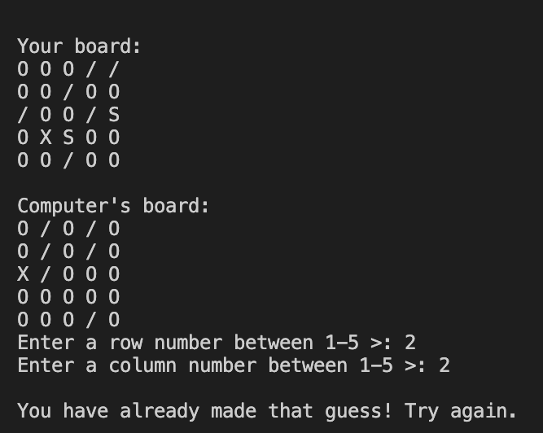
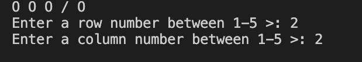
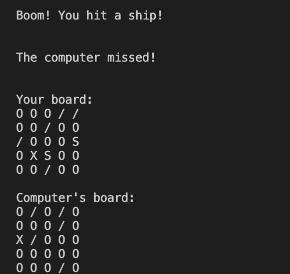

# Battleships Game

### About

Battleships is a classic naval strategy game where players take turns guessing the locations of enemy ships on a grid to sink them. This implementation of the game allows you to play against the computer, strategically firing shots to sink the opponent's ships while protecting your own fleet.

### How To Play

In Battleships, your objective is to locate and destroy four enemy ships on their 5x5 game board while protecting your own ships on your own game board. The game involves turn-based gameplay where you fire shots at the computer's board to sink their ships, and the computer fires shots at your board to sink your ships. Hits are marked with "X," and misses with "/", on both boards. The game continues until either you or the computer successfully sinks all four of the opponent's ships. Be strategic, use your shots wisely, and enjoy the challenge of outsmarting your opponent in this classic naval warfare game. 

# Features

### Existing Features

- The board is randomly generated.
   - Both boards are randomly generated.
   - The player can not see where the computers ships are.

- Allows the player to input coordinates (1-5/col-row) to fire shots.

- Allows only acceptable guesses to be made.
    - Gives error message if player enters:
        - Anything other than letters or nothing at all.
        - Anything outside of the 1-5 limit.
        - Any duplicate numbers used.
        

- Displays both the player's and computer's boards, showing hits and misses during gameplay.

### Future Features

* Add a welcome screen to ask the player's name.
* Implement the ability to play 2-player games via LAN.

# Testing

### Manual Testing

- Ensured that entering integer values outside the range of 1-5 resulted in error messages and retries.
- Verified that entering non-numeric characters prompted error messages and retries.
- Checked that entering empty values (pressing Enter) prompted error messages and retries.
- Confirmed that shots fired at specific column and row numbers were accurate (e.g., (5,4) and (2,3)).
- Tested the code for counting the number of specific characters on the board.
- Verified that four battleship locations are generated randomly upon board creation.
- Checked for any negative impacts when user input values rather than pressing Enter.

### Bugs/Updates after Testing

- Updated the input range to accept numbers between 1 and 5 for clarity.
- Fixed instances where confusion between rows and columns existed.
- Prevented the ship generating function from getting stuck in a loop with small boards.
- Changed the shots to 25 so the game wouldnt end randomly without a winner.

# Validator Testing

- Passed PEP8 Python validator. E501 line too long (80 > 79 characters) error message arises, PEP8 error not a python error.

# Deployment

- This project was deployed using Code Institute's mock terminal for Heroku. The deployment steps included:
-		Fork or clone this repository.
- 		Create a new Heroku app.
- 		Set the buildpacks to Python and NodeJS in that order.
- 		Link the Heroku app to the repository.
- 		Click on Deploy.

# Credits

- This project uses the Code Institute student template for deploying the third portfolio project, a Python command-line project.
- The idea of using Battleships is suggested by the Code Institute with "Ultimate Battleships" as inspiration.
- https://copyassignment.com/battleship-game-code-in-python/
- W3Schools
- YouTube: DR CODIE - Python Battleships